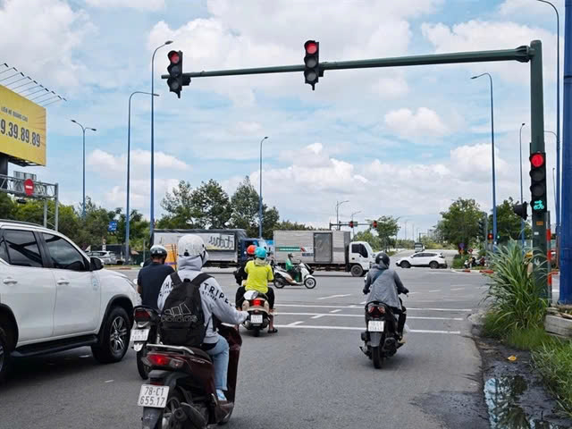
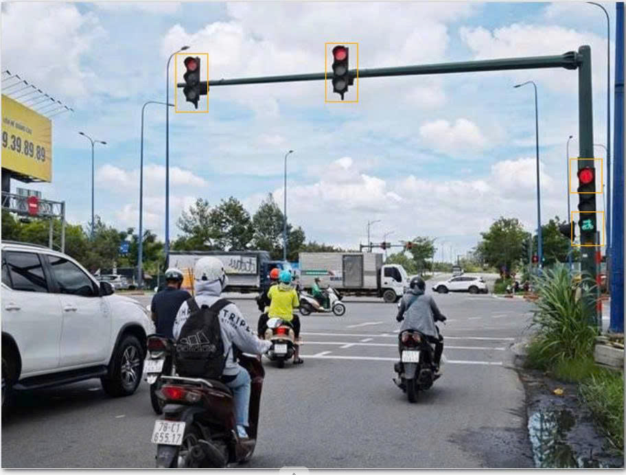
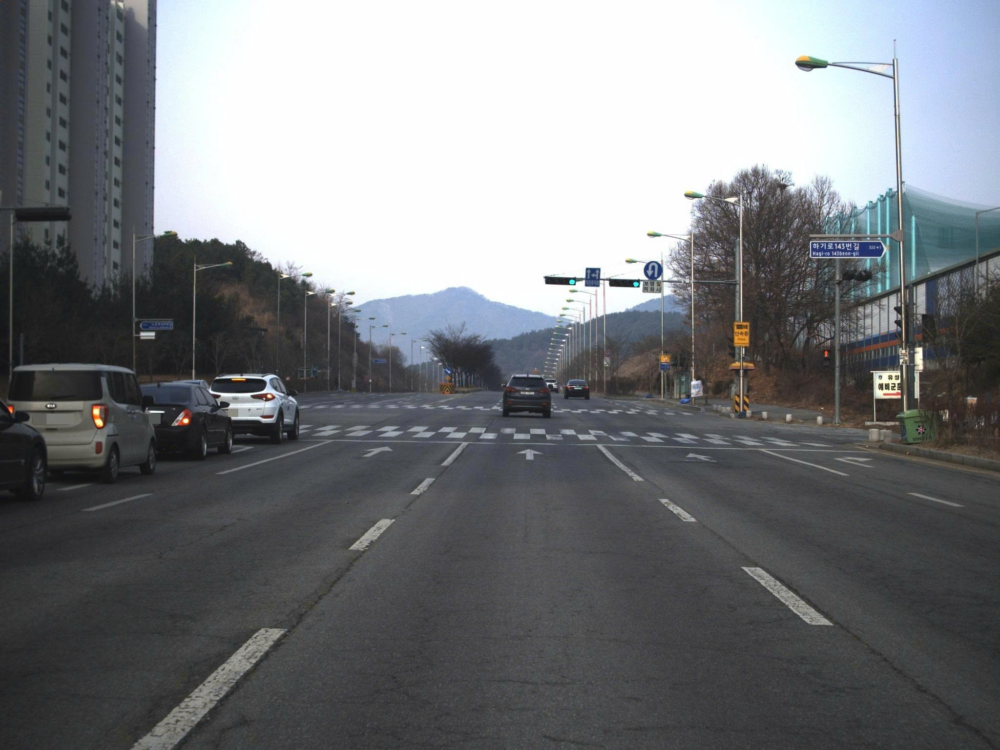
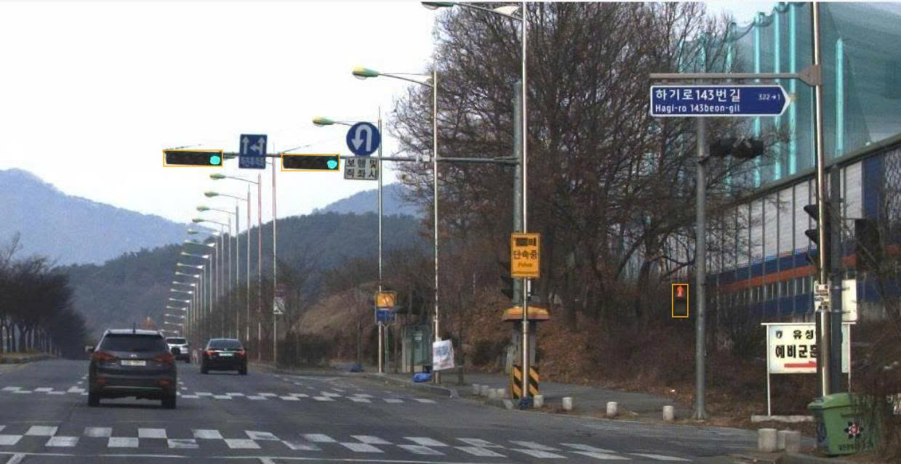

# Annotation guideline — đầu đèn giao thông cho xe cơ giới

**Version:** v2 — bổ sung quy tắc từ thư viện edge case của nhóm. Đây là bản dự thảo để rà soát; nhóm chưa có báo cáo calibration và chưa freeze gold. Không coi v2 là kết quả đã kiểm chứng qua calibration.

## 1. Objective + scope

Gắn bbox cho **đầu đèn giao thông dành cho xe cơ giới** có mặt tín hiệu nhìn được trong ảnh đường phố và ghi **màu đang sáng tại đúng ảnh đó**. Mục tiêu là dữ liệu nhận diện đầu đèn và màu hiển thị, không phải suy ra xe camera được đi, rẽ hướng nào, đèn có hỏng hay không.

Không gắn nhãn đèn người đi bộ, đèn xe đạp, bộ đếm thời gian, biển báo, đèn hậu hoặc ánh phản chiếu. Một ảnh có thể có cả đối tượng trong và ngoài scope; xét từng đầu đèn, không bỏ qua toàn ảnh chỉ vì có tín hiệu ngoài scope. `ego_applicability` là thuộc tính mô tả quan hệ với làn ego **khi có bằng chứng trực tiếp**, không phải kết luận xe được đi hay phải dừng.

## 2. Annotation unit

Mỗi JPEG là **một ảnh tĩnh** trong CVAT; dùng Shape, không dùng Track. Một bbox ứng với **một đầu/vỏ đèn** độc lập, không phải một bóng đèn hoặc cả giàn đèn. Nhiều bóng trong một vỏ chỉ tạo một bbox; hai vỏ cạnh nhau (ví dụ đầu mũi tên và đầu tròn) là hai bbox, **kể cả khi cùng gắn trên một giá treo hoặc có màu khác nhau**. Không nối các ảnh thành chuỗi thời gian.

## 3. Geometry rule

Dùng rectangle ôm sát **vỏ đầu đèn nhìn thấy được** (bao gồm các bóng trong vỏ), không ôm cột, thanh ngang, bảng số đếm, cành cây hoặc quầng sáng. Vẽ riêng từng đầu đèn, không vẽ một bbox bao trọn cả giàn.

Nếu đầu đèn bị che/cắt mép ảnh mà vẫn nhận diện được vỏ: bbox chỉ ôm **phần nhìn thấy**, dừng tại mép ảnh nếu vỏ thực sự chạm mép; không dựng lại phần khuất. Không tự đặt cạnh bbox tại `y=0` khi vỏ không chạm mép trên. Với đầu nhỏ/xa, vẫn vẽ khi phân biệt được vỏ; **không dùng ngưỡng 20 px hay khoảng cách 80 m làm điều kiện bỏ nhãn**. Nếu lóa/mờ đến mức không nhận diện được vỏ hoặc ranh giới, không vẽ bbox suy đoán; xử lý theo mục 7.

V2 chưa đặt tolerance bằng pixel/IoU vì chưa có đối chiếu bbox độc lập trên calibration. Người review đối chiếu quy tắc ôm phần vỏ nhìn thấy; cần chốt tolerance đo được trước khi dùng để chấm geometry định lượng.

## 4. Taxonomy

Dùng **một class** `vehicle_signal_head` (rectangle) và tag ảnh `image_escalate`. Schema CVAT có năm select trên mỗi bbox, khớp `03_ontology_and_cvat_setup.md` và `03_cvat_labels.json`.

| Tên                   | Kiểu             | Giá trị/default                                                                              | Khi dùng                                                                                                                                                                                                               |
| --------------------- | ---------------- | -------------------------------------------------------------------------------------------- | ---------------------------------------------------------------------------------------------------------------------------------------------------------------------------------------------------------------------- |
| `vehicle_signal_head` | Rectangle        | Một đầu đèn / bbox                                                                           | Đầu tín hiệu cho xe cơ giới, kể cả đầu mũi tên, đầu tối và đầu bị che nhưng nhận diện được vỏ.                                                                                                                         |
| `signal_form`         | Select trên bbox | `circular`, `arrow`, `unknown`; mặc định `__undefined__`                                     | `arrow` khi nhìn thấy ký hiệu mũi tên; `circular` khi nhận diện được mặt tín hiệu tròn không có mũi tên; không đủ bằng chứng thì `unknown`.                                                                            |
| `display`             | Select trên bbox | `red`, `yellow`, `green`, `unlit`, `unknown`; mặc định `__undefined__`                       | Ghi màu **đang sáng trên chính đầu đèn đó**. Vàng thấy rõ → `yellow`; `unlit` chỉ khi nhìn rõ các bóng đều không sáng; tối/mờ/lóa không đủ bằng chứng → `unknown`.                                                     |
| `arrow_direction`     | Select trên bbox | `left`, `straight`, `right`, `u_turn`, `unknown`, `not_applicable`; mặc định `__undefined__` | `signal_form=circular` → `not_applicable`; `signal_form=arrow` và đọc được hướng → hướng quan sát được; không đọc được hướng hoặc chưa rõ form → `unknown`. Không suy hướng đi thẳng từ vị trí của đèn tròn.           |
| `ego_applicability`   | Select trên bbox | `applies`, `does_not_apply`, `unknown`; mặc định `__undefined__`                             | `applies` / `does_not_apply` chỉ khi làn ego và hướng/làn mà đầu đèn điều khiển đều thể hiện rõ trong ảnh; nếu thiếu một trong hai bằng chứng → `unknown`. Không suy từ màu đỏ/xanh hoặc vị trí đèn trên ảnh.          |
| `needs_review`        | Select trên bbox | `yes`, `no`; mặc định `__undefined__`                                                        | `yes` nếu object nhận diện được nhưng màu, form, hướng hoặc quan hệ làn cần reviewer kiểm tra; `no` khi đã quyết định được theo rule mà không còn nghi vấn. `unknown` vì ảnh không đủ bằng chứng có thể đi cùng `yes`. |
| `image_escalate`      | Tag trên ảnh     | Có/không                                                                                     | Gắn khi còn nghi vấn về việc có nên label, không thể tách vỏ, nhiều màu không phân giải được, hoặc tình huống chưa có rule; không dùng tag để kết luận thiết bị lỗi.                                                   |

`__undefined__` chỉ là placeholder **chưa điền**, không được còn lại ở bất kỳ select nào trên bbox khi hoàn tất. `unknown` là kết quả hợp lệ sau khi đã xem ảnh nhưng ảnh không đủ bằng chứng; không đồng nghĩa với đèn tắt. Nếu trong cùng một vỏ có vẻ nhiều màu đang sáng mà không thể xác định trạng thái, chọn `display=unknown`, `needs_review=yes` và escalate; không lấy màu của đầu đèn bên cạnh để giải quyết.

## 5. Inclusion / exclusion

- **LABEL:** Đầu đèn cho xe cơ giới có mặt hướng về camera đủ để nhận diện vỏ, dù xa/nhỏ, bị che, cắt mép hoặc không đọc được màu. Đầu đèn nhìn rõ là tối vẫn label, chọn `display=unlit`; không suy đoán nguyên nhân tắt. Không yêu cầu xác định đầu đó áp dụng cho làn ego.
- **IGNORE:** Đèn người đi bộ/xe đạp (kể cả có màu sáng, cùng cột với đèn xe), bộ đếm số đứng riêng, đèn hậu, đèn đường, biển báo, phản chiếu và mặt sau đầu đèn quay khỏi camera. Một mảng/chấm sáng không nhận diện được vỏ đèn xe **không** tự trở thành `vehicle_signal_head`.
- Đầu mũi tên cho xe cơ giới vẫn **LABEL**; đọc màu và hướng trên **đầu đó**. Đầu mũi tên và đầu tròn cạnh nhau là hai object, có thể có hai màu khác nhau. Không lấy màu bộ đếm, đèn người đi bộ hay đầu bên cạnh để điền `display`.

## 6. Visibility / occlusion

Bị che một phần/cắt khung: label nếu vẫn nhận ra đầu đèn, bbox chỉ ôm phần thấy được. Đầu nhỏ/xa: nếu nhận ra vỏ nhưng không đọc được màu, `display=unknown` thay vì bỏ object hoặc đoán đỏ/xanh; nếu đọc được màu thì dùng màu đó. Không suy màu từ vị trí bóng (trên = đỏ, v.v.) hoặc từ pha của đầu bên cạnh.

Phân biệt **`unlit` và `unknown`**: chỉ chọn `unlit` khi ánh sáng/độ nét cho phép nhìn rõ các bóng đều không sáng; nếu cả vỏ tối do ngược sáng, che, lóa hoặc mất chi tiết thì chọn `unknown`. Nếu không đủ dấu hiệu để xác nhận là đầu đèn xe, không vẽ bbox; gặp nghi vấn thuộc scope thì gắn `image_escalate` theo mục 7. Không tự suy đèn hỏng, mất điện hay đang chuyển pha từ một ảnh tĩnh.

## 7. Ambiguity / escalation

| Quyết định | Khi nào                                                                                                                   | Biểu diễn trong CVAT/export                                                                                                                                                                                                                                  |
| ---------- | ------------------------------------------------------------------------------------------------------------------------- | ------------------------------------------------------------------------------------------------------------------------------------------------------------------------------------------------------------------------------------------------------------ |
| LABEL      | Chắc chắn là đầu đèn xe, màu đọc được hoặc bóng đều không sáng thấy rõ                                                    | Bbox `vehicle_signal_head` + `display=red/yellow/green/unlit`, điền đủ attribute.                                                                                                                                                                            |
| IGNORE     | Chắc chắn ngoài scope hoặc chắc chắn chỉ là phản chiếu/chấm sáng, không phải đầu đèn xe                                   | Không có bbox cho đối tượng đó; vẫn label các đầu hợp lệ khác trong ảnh.                                                                                                                                                                                     |
| UNKNOWN    | Chắc chắn là đầu đèn xe nhưng thuộc tính không đủ bằng chứng                                                              | Bbox `vehicle_signal_head` + giá trị `unknown` ở thuộc tính tương ứng; bật `needs_review=yes` nếu cần reviewer xác nhận.                                                                                                                                     |
| ESCALATE   | Không chắc thuộc scope, không thể xác định/tách ranh giới vỏ, nhiều màu không phân giải được hoặc tình huống chưa có rule | Tag ảnh `image_escalate`. Nếu **chắc chắn** là đầu đèn xe và xác định được vỏ thì thêm bbox với các giá trị quan sát được (`unknown` nếu không rõ) + `needs_review=yes`; nếu không chắc là đèn xe/không thấy vỏ thì **không** vẽ bbox suy đoán, chỉ tag ảnh. |

Tag không chỉ ra object nào: khi chuyển reviewer, ghi tên ảnh, vị trí vùng nghi vấn và câu hỏi cần quyết định trong ghi chú QA. Reviewer có thể quyết định label, ignore hoặc yêu cầu sửa; ghi lại lý do rồi mới bỏ tag/đổi annotation. Không gán `display=green` chỉ vì vệt lóa nhìn xanh khi không nhận diện được đầu đèn vật lý. **Không đổi gold đã freeze theo kết luận review**; nếu phát hiện gold sai, ghi trong báo cáo đối chiếu.

## 8. Temporal rule

**Không áp dụng — task ảnh tĩnh.** Không suy diễn đổi pha đỏ→xanh, đèn nhấp nháy, đèn vừa chuyển vàng hoặc hỏng từ một JPEG hay từ hai ảnh không có thời gian đáng tin. Nếu về sau dùng video/track, cần guideline và ontology phiên bản mới.

## 9. Examples

Hai ảnh dưới đây thuộc split `example` dự kiến của nhóm. Ảnh đã gắn nhãn là ảnh minh họa do nhóm cung cấp; **khung quanh đèn người đi bộ trong ảnh minh họa không phải nhãn hợp lệ** theo scope bài toán trong `01_problem_statement.md`. Expected output chỉ tính các đầu đèn xe cơ giới. Các tình huống trong thư viện edge case đã được đưa thành **rule tổng quát ở mục 2–7**, không công bố ảnh/đáp án blind trong guideline gửi peer.

| sample_id       | Thấy gì                                                         | Expected output                                                        | Rule áp dụng                                                                    |
| --------------- | --------------------------------------------------------------- | ---------------------------------------------------------------------- | ------------------------------------------------------------------------------- |
| `3` (`3.jpg`)   | Ba đầu đèn xe màu đỏ; bên phải còn có đèn người đi bộ màu xanh. | 3 bbox `vehicle_signal_head`, `display=red`; bỏ qua đèn người đi bộ.   | Chỉ gắn nhãn đầu đèn xe cơ giới, kể cả khi tín hiệu ngoài scope cùng xuất hiện. |
| `18` (`18.jpg`) | Hai đầu đèn xe màu xanh; bên phải có đèn người đi bộ màu đỏ.    | 2 bbox `vehicle_signal_head`, `display=green`; bỏ qua đèn người đi bộ. | Không lấy màu tín hiệu người đi bộ để gán cho đèn xe.                           |

**Ví dụ 1 — `3.jpg`**

Ảnh gốc:

Ảnh đã gắn nhãn (minh họa; chỉ các đầu đèn xe là nhãn hợp lệ):

**Ví dụ 2 — `18.jpg`**

Ảnh gốc:

Ảnh đã gắn nhãn (vùng ảnh được phóng to/cắt để nhìn rõ các đầu đèn; chỉ các đầu đèn xe là nhãn hợp lệ):

## 10. Common mistakes

- Vẽ một bbox cho cả cụm trên giá treo hoặc vẽ từng bóng thay vì từng **vỏ độc lập** → tách đúng theo mục 2–3, kể cả khi hai đầu đèn cùng giá treo có màu khác nhau.
- Bỏ đầu đèn nhỏ/xa hoặc đầu bị che/cắt mép dù vẫn nhận ra vỏ; ngược lại, vẽ bao cả cành cây, giá treo hay quầng sáng → chỉ ôm phần vỏ nhìn thấy.
- Label đèn người đi bộ/xe đạp hoặc bỏ qua toàn ảnh vì có tín hiệu ngoài scope → xét từng đối tượng theo mục 5.
- Điền màu theo đầu bên cạnh, vị trí bóng hoặc dự đoán pha tiếp theo; coi bóng tối/mờ là đèn tắt hay hỏng → chỉ gán theo bằng chứng trong ảnh, không chắc thì `unknown`.
- Gán `ego_applicability=applies` cho mọi đèn đỏ/xanh; ghi `arrow_direction=straight` cho đèn tròn → cần bằng chứng làn/hướng; đèn tròn có `arrow_direction=not_applicable`.
- Vẽ bbox suy đoán cho vệt lóa không thấy vỏ, hoặc để bất kỳ select nào là `__undefined__` khi hoàn tất → dùng tag `image_escalate` cho ca chưa xác định được và điền đủ giá trị cho bbox hợp lệ.
